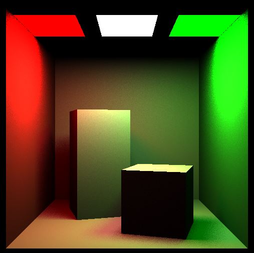

## About me

I am 23 years old student living in Prague, Czech Republic. Currently I am studying master's degree in Computer graphics at the Czech Technical University (CTU), Faculty of Electrical Engineering. In 2020 I successfully finished bachelor's degree in Software engineering at CTU FEE.

I am interested in IT, computer graphics, programming, drawing and architecture. Drawing is my hobby since my childhood, especially drawing of architecture and landscapes. Recently (since Q2 2019) I focuse on CG programming (OpenGL & C++, WebGL & JavaScript), 3D assets development (Autodesk Maya) and light game dev (Unity, Unreal Engine*).

Since May 2018 I work for Conquest Entertainment as programmer and e-shop maintainer. In 2020 (July) I started working for CZM at CTU as PHP programmer.

In future I would like to study illumination algorithms and other CG low-level principles. I would like to try DirectX programming (in contrast to OpenGL) and improve my knowledge of C++ / C#.

### Skills

* Computer graphics
    * OpenGL 3.0
    * WebGL 2.0
    * GLSL 1.0, 1.5
    * Autodesk Maya
    * Unity
* Web development
    * HTML5, CSS3, JavaScript ES6+
    * PHP, SQL
    * Enterprise Java, Spring
* Programming
    * JS ES6+, PHP, Java, C++, Python
    * Design patterns
    * VCS Gitlab

## Other skills & interests
* LaTex (Overleaf)
* Linear algebra, Mathematic analysis
* Adobe Premiere, Adobe Photoshop
* Drawing, Architecture

